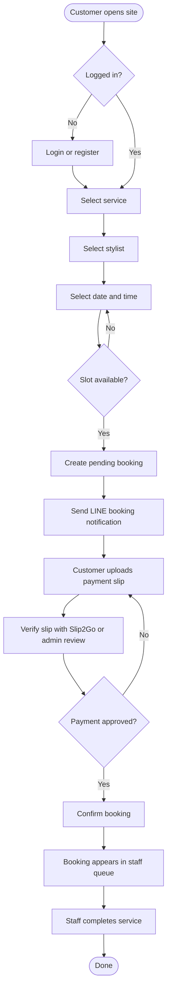

# Activity Flow - Booking and Payment

```mermaid
flowchart TD
    Start([Customer opens site])
    Login{Logged in?}
    RegisterOrLogin[Login or register]
    SelectService[Select service]
    SelectStaff[Select stylist]
    SelectSlot[Select date and time]
    ValidateSlot{Slot available?}
    CreateBooking[Create pending booking]
    NotifyLine[Send LINE booking notification]
    UploadSlip[Customer uploads payment slip]
    VerifySlip[Verify slip with Slip2Go or admin review]
    Paid{Payment approved?}
    ConfirmBooking[Confirm booking]
    StaffQueue[Booking appears in staff queue]
    Complete[Staff completes service]
    End([Done])

    Start --> Login
    Login -- No --> RegisterOrLogin --> SelectService
    Login -- Yes --> SelectService
    SelectService --> SelectStaff --> SelectSlot --> ValidateSlot
    ValidateSlot -- No --> SelectSlot
    ValidateSlot -- Yes --> CreateBooking --> NotifyLine --> UploadSlip
    UploadSlip --> VerifySlip --> Paid
    Paid -- No --> UploadSlip
    Paid -- Yes --> ConfirmBooking --> StaffQueue --> Complete --> End
```
