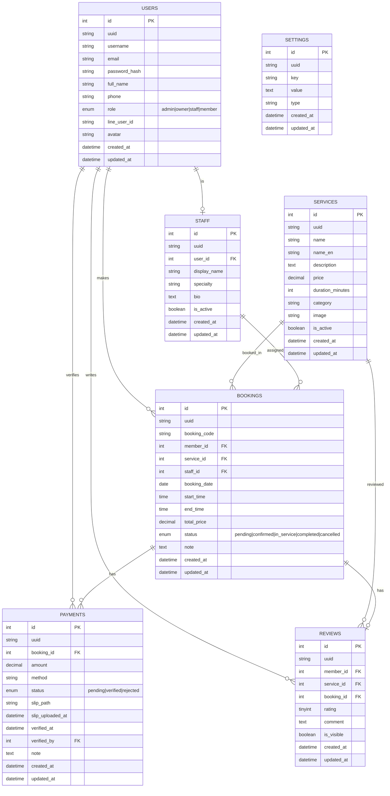

# Wikanda Hair Salon - Database ER Diagram

## Entity Relationship Diagram



---

## ตารางสรุปความสัมพันธ์

| ตารางหลัก | ตารางลูก | ความสัมพันธ์ | คำอธิบาย                                     |
| --------- | -------- | ------------ | -------------------------------------------- |
| users     | bookings | 1:N          | สมาชิก 1 คน จองได้หลายครั้ง                  |
| users     | reviews  | 1:N          | สมาชิก 1 คน รีวิวได้หลายครั้ง                |
| users     | staff    | 1:1          | ผู้ใช้ 1 คน เป็นช่างได้ 1 คน                 |
| users     | payments | 1:N          | ผู้ดูแล 1 คน ตรวจสอบการชำระเงินได้หลายรายการ |
| services  | bookings | 1:N          | บริการ 1 รายการ ถูกจองได้หลายครั้ง           |
| services  | reviews  | 1:N          | บริการ 1 รายการ มีรีวิวได้หลายรายการ         |
| staff     | bookings | 1:N          | ช่าง 1 คน รับงานได้หลายการจอง                |
| bookings  | payments | 1:N          | การจอง 1 รายการ มีการชำระเงินได้หลายครั้ง    |
| bookings  | reviews  | 1:1          | การจอง 1 รายการ มีรีวิวได้ 1 รายการ          |

---

## รายละเอียดตาราง

### 1. users (ผู้ใช้งาน)

เก็บข้อมูลผู้ใช้งานทั้งหมด: Admin, Owner, Staff, Member

| ฟิลด์         | ประเภท              | คำอธิบาย                           |
| ------------- | ------------------- | ---------------------------------- |
| id            | INT UNSIGNED AI PK  | รหัสผู้ใช้ (Auto Increment)        |
| uuid          | CHAR(36) UNIQUE     | รหัส UUID สำหรับอ้างอิงภายนอก      |
| username      | VARCHAR(80) UNIQUE  | ชื่อผู้ใช้งาน                      |
| email         | VARCHAR(160) UNIQUE | อีเมล                              |
| password_hash | VARCHAR(255)        | รหัสผ่าน (bcrypt)                  |
| full_name     | VARCHAR(160)        | ชื่อ-นามสกุล                       |
| phone         | VARCHAR(30)         | เบอร์โทรศัพท์                      |
| role          | ENUM                | บทบาท: admin, owner, staff, member |
| line_user_id  | VARCHAR(120)        | LINE User ID (สำหรับแจ้งเตือน)     |
| avatar        | VARCHAR(255)        | รูปโปรไฟล์                         |
| created_at    | DATETIME            | วันที่สร้าง                        |
| updated_at    | DATETIME            | วันที่อัปเดต                       |

---

### 2. services (บริการ)

เก็บข้อมูลบริการของร้าน

| ฟิลด์            | ประเภท             | คำอธิบาย                             |
| ---------------- | ------------------ | ------------------------------------ |
| id               | INT UNSIGNED AI PK | รหัสบริการ                           |
| uuid             | CHAR(36) UNIQUE    | รหัส UUID                            |
| name             | VARCHAR(160)       | ชื่อบริการ (ภาษาไทย)                 |
| name_en          | VARCHAR(160)       | ชื่อบริการ (ภาษาอังกฤษ)              |
| description      | TEXT               | รายละเอียด                           |
| price            | DECIMAL(10,2)      | ราคา                                 |
| duration_minutes | INT UNSIGNED       | ระยะเวลา (นาที)                      |
| category         | VARCHAR(80)        | หมวดหมู่: haircut, color, perm, etc. |
| image            | VARCHAR(255)       | รูปภาพบริการ                         |
| is_active        | TINYINT(1)         | สถานะเปิดใช้งาน                      |
| created_at       | DATETIME           | วันที่สร้าง                          |
| updated_at       | DATETIME           | วันที่อัปเดต                         |

---

### 3. staff (ช่าง/พนักงาน)

เก็บข้อมูลเพิ่มเติมของช่าง (เชื่อมกับ users)

| ฟิลด์        | ประเภท             | คำอธิบาย         |
| ------------ | ------------------ | ---------------- |
| id           | INT UNSIGNED AI PK | รหัสช่าง         |
| uuid         | CHAR(36) UNIQUE    | รหัส UUID        |
| user_id      | INT UNSIGNED FK    | อ้างอิง users.id |
| display_name | VARCHAR(160)       | ชื่อที่แสดง      |
| specialty    | VARCHAR(160)       | ความเชี่ยวชาญ    |
| bio          | TEXT               | ประวัติย่อ       |
| is_active    | TINYINT(1)         | สถานะเปิดใช้งาน  |
| created_at   | DATETIME           | วันที่สร้าง      |
| updated_at   | DATETIME           | วันที่อัปเดต     |

---

### 4. bookings (การจอง)

เก็บข้อมูลการจองคิว

| ฟิลด์        | ประเภท             | คำอธิบาย                                                    |
| ------------ | ------------------ | ----------------------------------------------------------- |
| id           | INT UNSIGNED AI PK | รหัสการจอง                                                  |
| uuid         | CHAR(36) UNIQUE    | รหัส UUID                                                   |
| booking_code | VARCHAR(40) UNIQUE | รหัสจอง (เช่น WK20260501-001)                               |
| member_id    | INT UNSIGNED FK    | อ้างอิง users.id (สมาชิก)                                   |
| service_id   | INT UNSIGNED FK    | อ้างอิง services.id                                         |
| staff_id     | INT UNSIGNED FK    | อ้างอิง staff.id                                            |
| booking_date | DATE               | วันที่จอง                                                   |
| start_time   | TIME               | เวลาเริ่ม                                                   |
| end_time     | TIME               | เวลาสิ้นสุด                                                 |
| total_price  | DECIMAL(10,2)      | ราคารวม                                                     |
| status       | ENUM               | สถานะ: pending, confirmed, in_service, completed, cancelled |
| note         | TEXT               | หมายเหตุ                                                    |
| created_at   | DATETIME           | วันที่สร้าง                                                 |
| updated_at   | DATETIME           | วันที่อัปเดต                                                |

---

### 5. payments (การชำระเงิน)

เก็บข้อมูลการชำระเงิน

| ฟิลด์            | ประเภท             | คำอธิบาย                                 |
| ---------------- | ------------------ | ---------------------------------------- |
| id               | INT UNSIGNED AI PK | รหัสการชำระเงิน                          |
| uuid             | CHAR(36) UNIQUE    | รหัส UUID                                |
| booking_id       | INT UNSIGNED FK    | อ้างอิง bookings.id                      |
| amount           | DECIMAL(10,2)      | จำนวนเงิน                                |
| method           | VARCHAR(40)        | วิธีชำระ: promptpay, bank_transfer, cash |
| status           | ENUM               | สถานะ: pending, verified, rejected       |
| slip_path        | VARCHAR(255)       | ที่อยู่ไฟล์สลิป                          |
| slip_uploaded_at | DATETIME           | วันที่อัปโหลดสลิป                        |
| verified_at      | DATETIME           | วันที่ตรวจสอบ                            |
| verified_by      | INT UNSIGNED FK    | อ้างอิง users.id (ผู้ตรวจสอบ)            |
| note             | TEXT               | หมายเหตุ                                 |
| created_at       | DATETIME           | วันที่สร้าง                              |
| updated_at       | DATETIME           | วันที่อัปเดต                             |

---

### 6. reviews (รีวิว)

เก็บข้อมูลรีวิวจากลูกค้า

| ฟิลด์      | ประเภท             | คำอธิบาย            |
| ---------- | ------------------ | ------------------- |
| id         | INT UNSIGNED AI PK | รหัสรีวิว           |
| uuid       | CHAR(36) UNIQUE    | รหัส UUID           |
| member_id  | INT UNSIGNED FK    | อ้างอิง users.id    |
| service_id | INT UNSIGNED FK    | อ้างอิง services.id |
| booking_id | INT UNSIGNED FK    | อ้างอิง bookings.id |
| rating     | TINYINT UNSIGNED   | คะแนน 1-5           |
| comment    | TEXT               | ความคิดเห็น         |
| is_visible | TINYINT(1)         | แสดงผลหรือไม่       |
| created_at | DATETIME           | วันที่สร้าง         |
| updated_at | DATETIME           | วันที่อัปเดต        |

---

### 7. settings (ตั้งค่าระบบ)

เก็บการตั้งค่าของระบบ

| ฟิลด์      | ประเภท              | คำอธิบาย                        |
| ---------- | ------------------- | ------------------------------- |
| id         | INT UNSIGNED AI PK  | รหัสการตั้งค่า                  |
| uuid       | CHAR(36) UNIQUE     | รหัส UUID                       |
| key        | VARCHAR(120) UNIQUE | ชื่อการตั้งค่า                  |
| value      | TEXT                | ค่าการตั้งค่า                   |
| type       | VARCHAR(40)         | ประเภท: string, boolean, secret |
| created_at | DATETIME            | วันที่สร้าง                     |
| updated_at | DATETIME            | วันที่อัปเดต                    |

---

## Foreign Key Constraints

```sql
-- staff.user_id -> users.id
ALTER TABLE staff ADD CONSTRAINT staff_user_fk
    FOREIGN KEY (user_id) REFERENCES users(id) ON DELETE CASCADE;

-- bookings.member_id -> users.id
ALTER TABLE bookings ADD CONSTRAINT bookings_member_fk
    FOREIGN KEY (member_id) REFERENCES users(id) ON DELETE CASCADE;

-- bookings.service_id -> services.id
ALTER TABLE bookings ADD CONSTRAINT bookings_service_fk
    FOREIGN KEY (service_id) REFERENCES services(id) ON DELETE RESTRICT;

-- bookings.staff_id -> staff.id
ALTER TABLE bookings ADD CONSTRAINT bookings_staff_fk
    FOREIGN KEY (staff_id) REFERENCES staff(id) ON DELETE RESTRICT;

-- payments.booking_id -> bookings.id
ALTER TABLE payments ADD CONSTRAINT payments_booking_fk
    FOREIGN KEY (booking_id) REFERENCES bookings(id) ON DELETE CASCADE;

-- payments.verified_by -> users.id
ALTER TABLE payments ADD CONSTRAINT payments_verified_by_fk
    FOREIGN KEY (verified_by) REFERENCES users(id) ON DELETE SET NULL;

-- reviews.member_id -> users.id
ALTER TABLE reviews ADD CONSTRAINT reviews_member_fk
    FOREIGN KEY (member_id) REFERENCES users(id) ON DELETE CASCADE;

-- reviews.service_id -> services.id
ALTER TABLE reviews ADD CONSTRAINT reviews_service_fk
    FOREIGN KEY (service_id) REFERENCES services(id) ON DELETE CASCADE;

-- reviews.booking_id -> bookings.id
ALTER TABLE reviews ADD CONSTRAINT reviews_booking_fk
    FOREIGN KEY (booking_id) REFERENCES bookings(id) ON DELETE SET NULL;
```

---

## Indexes

```sql
-- Users
CREATE INDEX users_role_index ON users(role);

-- Services
CREATE INDEX services_active_index ON services(is_active);

-- Staff
CREATE INDEX staff_user_index ON staff(user_id);

-- Bookings
CREATE INDEX bookings_member_index ON bookings(member_id);
CREATE INDEX bookings_staff_date_index ON bookings(staff_id, booking_date);
CREATE INDEX bookings_status_index ON bookings(status);

-- Payments
CREATE INDEX payments_booking_index ON payments(booking_id);
CREATE INDEX payments_status_index ON payments(status);

-- Reviews
CREATE INDEX reviews_member_index ON reviews(member_id);
CREATE INDEX reviews_service_index ON reviews(service_id);
```

---

**เอกสารนี้อัปเดตล่าสุด:** 2026-06-06
float total_price
}

    PAYMENTS {
        int id PK
        string uuid
        int booking_id FK
        float amount
        string status
        string slip_path
        string verified_at
    }

    REVIEWS {
        int id PK
        string uuid
        int member_id FK
        int service_id FK
        int rating
        string comment
    }

```

Notes:
- Phase 1 persists these entities as JSON files.
- Every record keeps both `id` for internal references and `uuid` for public-safe identifiers.
- Phase 7 can map this structure to MySQL without changing service-layer contracts.
```
