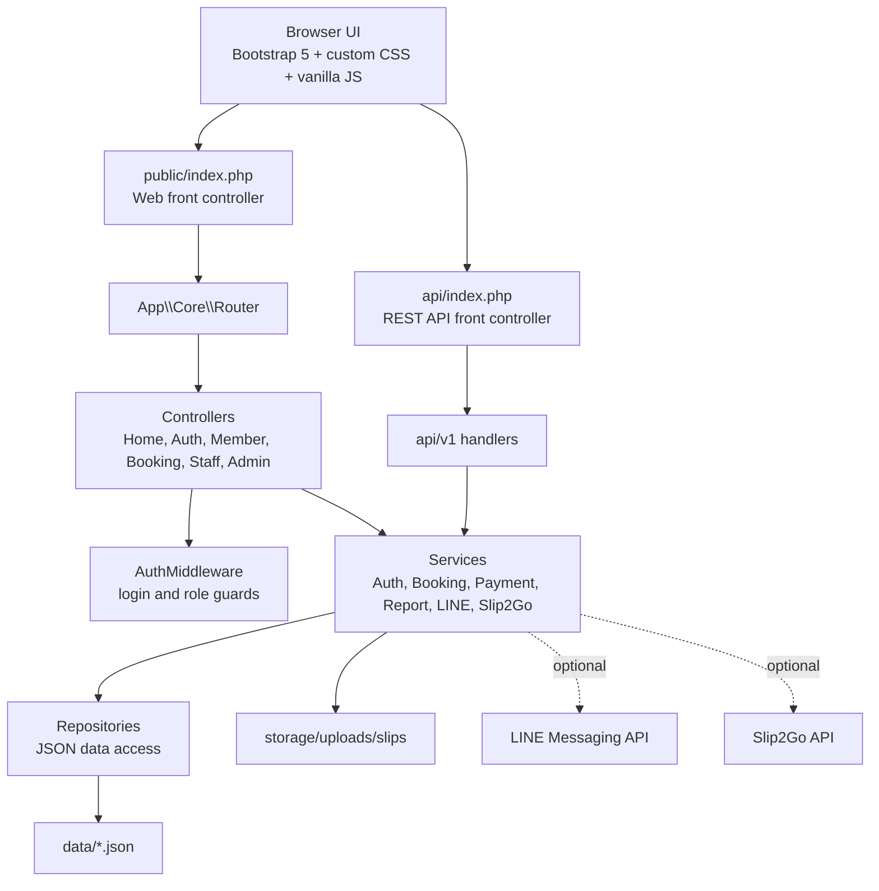

# System Architecture - Wikanda Hair Salon

Deployment target:
- XAMPP Apache + PHP 8+.
- `public/` is the web root.
- JSON storage is current production mode for this phase.
- MySQL migration is reserved for Phase 7.
