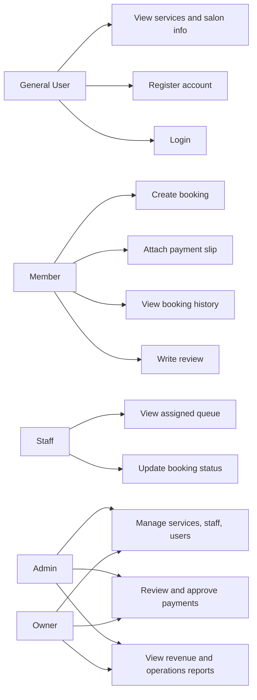

# Use Case Diagram - Wikanda Hair Salon

Role scope:
- Guest can browse, register, and log in.
- Member can book, pay, review, and track history.
- Staff handles daily assigned queues and status updates.
- Admin and Owner manage operations, payments, and reports.
