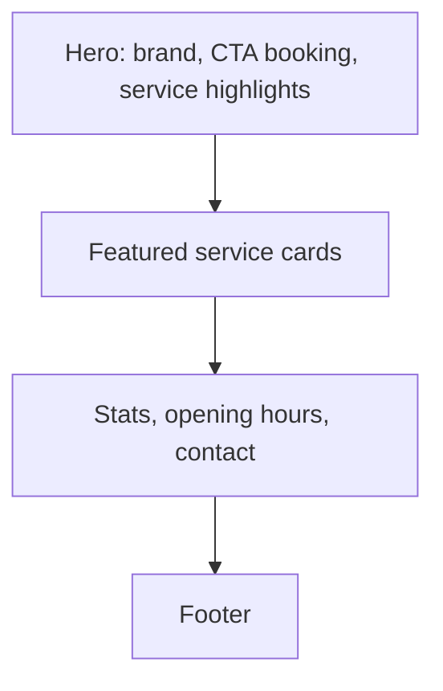
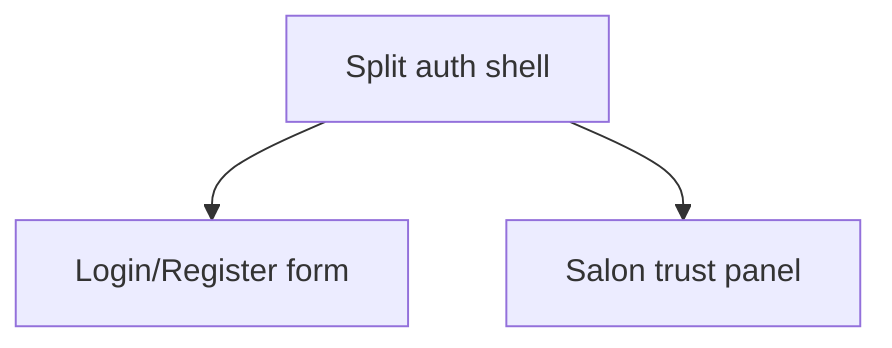
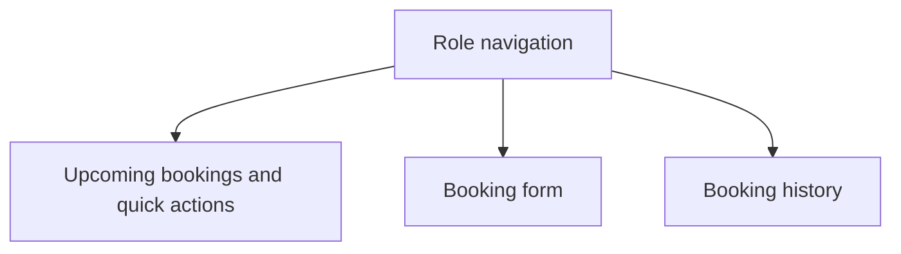
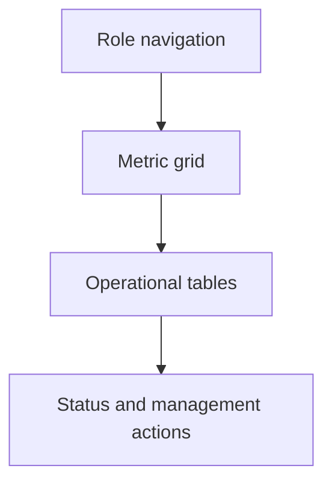

# Wireframe Notes - Wikanda Hair Salon

## Public Home

## Auth

## Member

## Admin / Owner / Staff

Design direction:
- Premium salon feel with warm neutrals, rose accents, glass panels, and high readability.
- Dense enough for repeated admin/staff work, but still polished for customers.
- Mobile-first layouts with no horizontal overflow.
